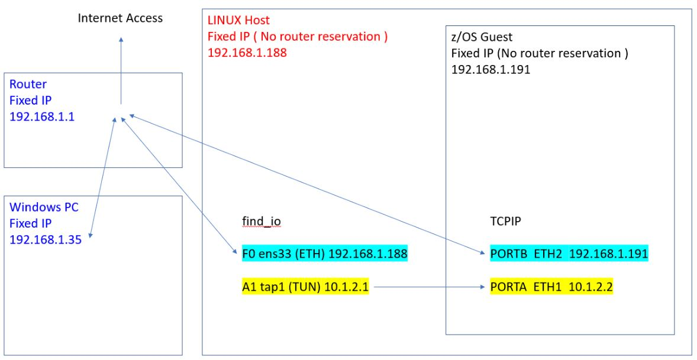

# TCPIP and Certificates Customisation.

Each time, my customisations get better.
This time

* I want to use the Tunnel for TCPIP because that's what ZVA does
* I want to check out all the certificates ( z/OSMF, ShopZ etc... )

## TCPIP High Level





Probably need to switch 192.168.1.191 to 172.20.64.8 when I go to ZVA ?

## ZD&T Application in P52 Linux 

User ibmsys1 invoked find_io command

```
[ibmsys1@localhost Z25B001]$ find_io
   
 FIND_IO for "ibmsys1@localhost.localdomain" 
                                                                                                
         Interface         Current          MAC                IPv4              IPv6           
 Path    Name              State            Address            Address           Address        
------   ----------------  ---------------- -----------------  ----------------  -------------- 
  F0     enp0s31f6         UP, RUNNING      e8:6a:64:5d:2e:8a  192.168.1.188     fe80::8124:21fd:e178:6d63%enp0s31f6  
  F1     wlp0s20f3         DOWN             d6:a8:9b:eb:d2:e6  *                 *               
. 
  *      virbr0            UP, NOT-RUNNING  52:54:00:a4:96:d1  192.168.122.1     *               
  *      virbr0-nic        DOWN             52:54:00:a4:96:d1  *                 *               
. 
  A0     tap0              DOWN             02:a0:a0:a0:a0:a0  *                 *               
  A1     tap1              DOWN             02:a1:a1:a1:a1:a1  *                 *               
  A2     tap2              DOWN             02:a2:a2:a2:a2:a2  *                 *               
  A3     tap3              DOWN             02:a3:a3:a3:a3:a3  *                 *               
  A4     tap4              DOWN             02:a4:a4:a4:a4:a4  *                 *               
  A5     tap5              DOWN             02:a5:a5:a5:a5:a5  *                 *               
  A6     tap6              DOWN             02:a6:a6:a6:a6:a6  *                 *               
  A7     tap7              DOWN             02:a7:a7:a7:a7:a7  *                 *               
   
                                                                                                
         Interface                         Current Settings                                     
 Path    Name              RxChkSum      TSO     GSO     GRO     LRO    RX VLAN       MTU**     
------   ----------------  ---------------- -----------------  ----------------  -------------- 
  F0     enp0s31f6           Off         On*     Off     Off     Off      Off         1500 
  F1     wlp0s20f3           Off         Off     On*     On*     Off      Off         1500 
. 
  *      virbr0              Off         On*     On*     On*     Off      Off         1500 
  *      virbr0-nic          Off         Off     On*     On*     Off      Off         1500 

```

devmap configuration is defined to place the Tunnel NIC on Path A1, which will use addresses 10.1.2.x so that Linux is 10.1.2.1 and zOS is 10.1.2.2 

```
[manager]  # tap define network adapter (OSA) for communication with Linux
name awsosa 0024 --path=A1 --pathtype=OSD --tunnel_intf=y   # QDIO mode
device 400 osa osa --unitadd=0
device 401 osa osa --unitadd=1
device 402 osa osa --unitadd=2

[manager]  # OSA define OSA for general network communication
name awsosa 0022 --path=F0 --pathtype=OSD 
device 404 osa osa  
device 405 osa osa  
device 406 osa osa  
```

Repeat find_io

```
[ibmsys1@localhost Z25B001]$ find_io
   
 FIND_IO for "ibmsys1@localhost.localdomain" 
                                                                                                
         Interface         Current          MAC                IPv4              IPv6           
 Path    Name              State            Address            Address           Address        
------   ----------------  ---------------- -----------------  ----------------  -------------- 
  F0     enp0s31f6         UP, RUNNING      e8:6a:64:5d:2e:8a  192.168.1.188     fe80::8124:21fd:e178:6d63%enp0s31f6  
  F1     wlp0s20f3         DOWN             d6:a8:9b:eb:d2:e6  *                 *               
. 
  *      virbr0            UP, NOT-RUNNING  52:54:00:a4:96:d1  192.168.122.1     *               
  *      virbr0-nic        DOWN             52:54:00:a4:96:d1  *                 *               
. 
  A0     tap0              DOWN             02:a0:a0:a0:a0:a0  *                 *               
  A1     tap1              UP, RUNNING      16:e6:47:f7:e4:3c  10.1.2.1          fe80::14e6:47ff:fef7:e43c%tap1  
  A2     tap2              DOWN             02:a2:a2:a2:a2:a2  *                 *               
  A3     tap3              DOWN             02:a3:a3:a3:a3:a3  *                 *               
  A4     tap4              DOWN             02:a4:a4:a4:a4:a4  *                 *               
  A5     tap5              DOWN             02:a5:a5:a5:a5:a5  *                 *               
  A6     tap6              DOWN             02:a6:a6:a6:a6:a6  *                 *               
  A7     tap7              DOWN             02:a7:a7:a7:a7:a7  *                 *               
```


## Edit TCPIP in z/OS

Review ADCD.Z25B.VTAMLST(OSATRL2) to see the port names (PORTA is the Tunnel, PORTB is the OSA)

```
OSATRL1 VBUILD TYPE=TRL 
OSATRL1E TRLE LNCTL=MPC,READ=(0400),WRITE=(0401),DATAPATH=(0402),      X
               PORTNAME=PORTA,                                         X
               MPCLEVEL=QDIO 
OSATRL2E TRLE LNCTL=MPC,READ=(0404),WRITE=(0405),DATAPATH=(0406),      X
               PORTNAME=PORTB,                                         X
               MPCLEVEL=QDIO 

```


### Check the TCPIP task in PROCLIB

ADCD.Z25B.PROCLIB(TCPIP) has PROFILE DD Card as ```//PROFILE  DD DISP=SHR,DSN=ADCD.&SYSVER..TCPPARMS(PROF2) ```

Look inside PROF2 - Edit it to point to zpdtdev2 instead of zpdtdev1

```
include adcd.Z25B.tcpparms(zconnect) 
include adcd.Z25B.tcpparms(zcxdvipa) 
include adcd.Z25B.zcloud(inc) 
; ------------------------------------------------------------- 
; Support zPDT Linux Base to z/OS Tunnel (STAND ALONE) 
; Used to access TCPIP applications from the zPDT Linux Base 
; workstation. 
; ------------------------------------------------------------- 
;include adcd.Z25B.tcpparms(zpdtdev2) 
; ------------------------------------------------------------- 
; zPDT External   to z/OS Connections (OPTIONAL) 
; Support zPDT External   to z/OS Connections via zPDT workstation 
; Edit zpdtdev2 and follow the instructions to change assigned 
; IP address and default route statements 
; ------------------------------------------------------------- 
include adcd.Z25B.tcpparms(zpdtdev2)  
```


And check the started task output in SDSF

```
EZZ0162I HOST NAME FOR TCPIP IS S0W1                         
EZZ0300I OPENED INCLUDE FILE 'ADCD.Z25B.TCPPARMS(ZCONNECT)'  
EZZ0300I OPENED INCLUDE FILE 'ADCD.Z25B.TCPPARMS(ZCXDVIPA)'  
EZZ0300I OPENED INCLUDE FILE 'ADCD.Z25B.ZCLOUD(INC)'         
EZZ0300I OPENED INCLUDE FILE 'ADCD.Z25B.TCPPARMS(ZPDTDEV2)'  
EZZ0300I OPENED PROFILE FILE DD:PROFILE                      
EZZ0309I PROFILE PROCESSING BEGINNING FOR DD:PROFILE         
```
Ignore adcd.Z25B.tcpparms(zconnect) until you want to run ZCEE

Setup the DVIPA for ZCX ( for later on ). Edit adcd.Z25B.tcpparms(zcxdvipa) 

```
  VIPADYNAMIC 
; ------------------------------------------------------------------ 
;  Define VIPA Range ONLY for ZCX 
; ------------------------------------------------------------------ 
   VIPARANGE DEFINE 255.255.255.255 10.1.2.5       ZCX 
; 
  ENDVIPADYNAMIC 

```


Update ADCD.Z25A.TCPPARMS(ZPDTDEV2) to access z/OS and Linux via a tunnel:
- The IP address used to access z/OS from Linux (via tunnel) is 10.1.2.1
- The IP address used to access Linux from z/OS (via tunnel) is 10.1.2.2
- The IP address used by z/OS is 192.168.1.191

```
; 
  DEVICE PORTA MPCIPA 
  LINK OSDL IPAQENET ADM1ETP 
  LINK ETH1 IPAQENET PORTA 
; ------------------------------------------------------------------- 
; Device to support zPDT External   to z/OS Connections 
; ------------------------------------------------------------------- 
; 
  DEVICE PORTB    MPCIPA 
  LINK ETH2 IPAQENET  PORTB 
;-------------------------------------------------------------------- 
; Home   to support zPDT External   to z/OS Connections 
; ------------------------------------------------------------------- 
; 
  HOME 10.1.2.2       ETH1 
  HOME 192.168.1.191  ETH2 
; ------------------------------------------------------------------- 
; Routes to support zPDT External   to z/OS Connections 
; ------------------------------------------------------------------- 
; 
  BEGINRoutes 
  ; Destination        SubnetMask    FirstHop       LinkName    Size 
  ROUTE 10.1.2.0       255.255.255.0    =            ETH1   MTU 1500 
  ROUTE 192.168.1.0    255.255.255.0    =            ETH2   MTU 1500 
  ; Destination                      First Hop      LinkName    Size 
  ROUTE DEFAULT                      192.168.1.1     ETH2   MTU 1500 
  ENDRoutes 
; ------------------------------------------------------------------- 
; Start  to support zPDT External   to z/OS Connections 
; ------------------------------------------------------------------- 
; 
 START ADM1ETP 
 START PORTA 
 START PORTB 

```


Edit the Resolver file : ADCD.Z25B.TCPPARMS(GBLRESOL) 

```
  DEFAULTTCPIPDATA('ADCD.Z25B.TCPPARMS(GBLTDATA)') 
  GLOBALTCPIPDATA('ADCD.Z25B.TCPPARMS(GBLTDATA)') 
; 
# ----------------------------------------------------------------- 
# Default zPDT Linux Base to z/OS Tunnel (Stand-Alone) 
# ----------------------------------------------------------------- 
; 
; GLOBALIPNODES('ADCD.Z25B.TCPPARMS(ZPDTIPN1)') 
# ----------------------------------------------------------------- 
# External connection VIA zPDT Linux Base to z/OS Tunnel using NAT 
# ----------------------------------------------------------------- 
; 
  GLOBALIPNODES('ADCD.Z25B.TCPPARMS(ZPDTIPN2)') 
; 
# ----------------------------------------------------------------- 
# Default zPDT Linux Base to z/OS Tunnel (Stand-Alone) 
# ----------------------------------------------------------------- 
; 
# DEFAULTIPNODES('ADCD.Z25B.TCPPARMS(ZPDTIPN1)') 
# ----------------------------------------------------------------- 
# External connection VIA zPDT Linux Base to z/OS Tunnel using NAT 
# ----------------------------------------------------------------- 
; 
  DEFAULTIPNODES('ADCD.Z25B.TCPPARMS(ZPDTIPN2)') 
; 
  COMMONSEARCH 
  CACHE 
  CACHESIZE(200M) 
  MAXTTL(2147483647) 
  UNRESPONSIVETHRESHOLD(25) 

```

Edit ADCD.Z25B.TCPPARMS(ZPDTIPN2)

```
 10.1.2.1        RHEL                             
 192.168.1.191   S0W1.DAL-EBIS.IHOST.COM S0W1 
 127.0.0.1       LOCALHOST 

```

Edit ADCD.Z25B.TCPPARMS(GBLTDATA)

```
TCPIPJOBNAME TCPIP 

S0W1:   HOSTNAME   S0W1 

DOMAINORIGIN  DAL-EBIS.IHOST.COM 

DATASETPREFIX TCPIP 

NSINTERADDR 8.8.8.8 

RESOLVERTIMEOUT 30 
```

### Re-IPL and Test 

Tests
* 3270 Emulator - connects. ( ISPF Settings Option 0 to place cursor at top, and screen format as 3. Max )
* ssh - fine
* ftp - connection refused. ( FTPD wasnt started )


## Certificates

Previously found expired certificates in zOSMF KEYRING

Checkout ```ADCD.Z25B.PARMLIB(IZUPRM00)```

contains ```KEYRING_NAME('IZUKeyring.IZUDFLT')```


