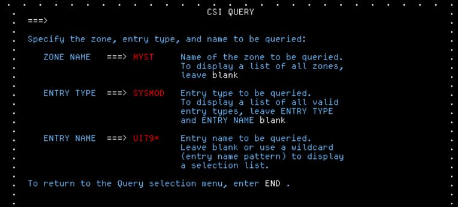
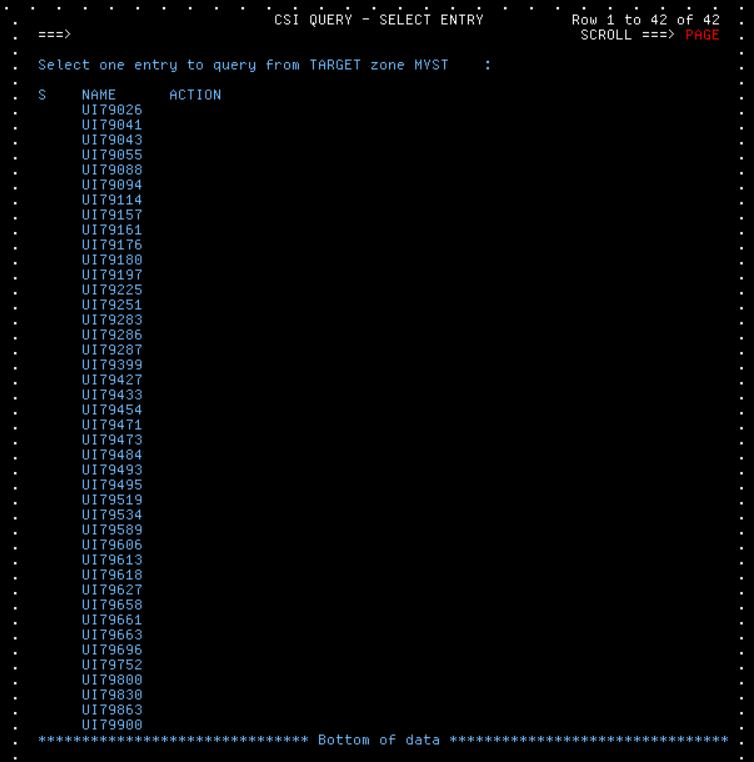

# ShopZ maintenance procedure


# Process

Maintenance Process is
1. Check if PTF installed in Target Zone
2. Run a Report
3. ShopZ Order PTF ( and upload the report )
4. Edit JCL to perform secure download to ZFS
5. Run an SMPE Apply
6. Read the Hold Data ( eg: restart z/OSMF )


## 1. Check if PTF installed in Target Zone
Identify the Global Zone for zOSMF = MVS.GLOBAL.CSI 

Run an SMPE Query



Check Results : PTF UI79663 not installed in the target zone



### Example : Z AI Libraries

UJ08004 UJ08444 UJ08448 UI80106 UI80156 UI80826 UJ08371 UJ08381

not applied
UJ08444 UJ08448 UI80106 UI80826 UJ08371 UJ08381


## 2. Run a Report 

IBMUSER.CNTL(SMPRPT)

```
//IBMUSERJ JOB  (NPA),'INIT 3380 DASD',CLASS=A,MSGCLASS=H,   
//             NOTIFY=&SYSUID,MSGLEVEL=(1,1),REGION=0M       
//* GENERATE INSTALLED SOFTWARE REPORT                       
//STEP1    EXEC PGM=GIMXSID,PARM='WAIT=10MIN,L=ENU'          
//SYSPRINT DD SYSOUT=*                                       
//SMPOUT   DD SYSOUT=*                                       
//SMPXTOUT DD PATH='/u/ibmuser/reports/mvs.report',          
//            PATHOPTS=(OWRONLY,OCREAT,OTRUNC),              
//            FILEDATA=BINARY,PATHMODE=(SIRWXU,SIRWXG,SIRWXO)
//SYSIN    DD DATA,DLM=$$                                    
CSI=MVS.GLOBAL.CSI                                           
TARGET=MVST                                                  
$$                                                           
```

FTP Download to PC as binary ```C:\ZODD2023\reports\mvs.report```

## 3. ShopZ Order PTF ( and upload the report )

Order PTFs, Upload report with order

## 4. Edit JCL to perform secure download to ZFS

This does (a) Download to ZFS plus (b) SMPE RECEIVE into Global Zone

```
//IBMUSERJ JOB  (NPA),'INIT 3380 DASD',CLASS=A,MSGCLASS=H,
//             NOTIFY=&SYSUID,MSGLEVEL=(1,1),REGION=0M                                
//*                                                                             
//SMPER1  EXEC PGM=GIMSMP,REGION=0M,                                            
//             PARM='PROCESS=WAIT'                                              
//SMPCSI   DD  DISP=SHR,DSN=MVS.GLOBAL.CSI                     
//SMPNTS   DD  PATHDISP=KEEP,                                                   
//             PATH='/u/ibmuser/smpework/maint/'                       
//SMPOUT   DD  SYSOUT=*                                                         
//SMPRPT   DD  SYSOUT=*                                                         
//SMPLIST  DD  SYSOUT=*                                                         
//SYSPRINT DD  SYSOUT=*                                                         
//SMPCNTL  DD  *                                                                
  SET      BOUNDARY (GLOBAL) .                                                  
  RECEIVE                                                                       
        FROMNETWORK(                                                            
          SERVER(SERVINFO)                                                       
          CLIENT(CLNTINFO)                                                      
          )                                                                     
           .                                                                    
/*                                                                              
//*                                                                             
//SERVINFO DD *                                                                 
  <SERVER                                                                       
    host="deliverycb-bld.dhe.ibm.com"                                                         
    user="S7955q41"                                                             
    pw="C3018808413D87p"                                                          
    >                                                                           
    <PACKAGE                                                                    
      file="2022100798283/PROD/GIMPAF.XML"                                                      
      hash="207ADD87E84D25CC94115242850D193BA442A7A3"                                                          
      id="U02386366"                                                            
      >                                                                         
    </PACKAGE>                                                                  
  </SERVER>                                                                     
/*                                                                              
//*                                                                             
//CLNTINFO DD *                                                                       
<CLIENT                              
    downloadmethod="https"           
    downloadkeyring="javatruststore" 
       >                             
</CLIENT>                            
/*                                                                               
//*                                                                             
```


## 5. Run an SMPE Apply

first with the CHECK, Then without.

```
//IBMUSERJ JOB  (NPA),'INIT 3380 DASD',CLASS=A,MSGCLASS=H,   
//             NOTIFY=&SYSUID,MSGLEVEL=(1,1),REGION=0M       
//* APPLY PTFS RECEIVED FROM SHOPZ ORDER                     
//RECNTS   EXEC PGM=GIMSMP,REGION=0M,                        
//         PARM='CSI=MVS.GLOBAL.CSI'                         
//SMPOUT   DD SYSOUT=*                                       
//SMPLOG   DD SYSOUT=*                                       
//SMPNTS   DD PATH='/u/ibmuser/smpework/maint'               
//*SMPJHOME DD PATH='/usr/lpp/java/J8.0/',PATHDISP=KEEP      
//SYSUT1   DD UNIT=SYSDA,SPACE=(CYL,(380,760)),DSNTYPE=LARGE,
//            STORCLAS=BIGSMS                                
//SYSUT2   DD UNIT=SYSDA,SPACE=(3120,(380,760))              
//SYSUT3   DD UNIT=SYSDA,SPACE=(3120,(380,760))              
//SYSUT4   DD UNIT=SYSDA,SPACE=(3120,(380,760))              
//*SMPHOLD  DD DISP=SHR,DSN=ADCDMST.HOLDDATA.TXT             
//SYSPRINT DD SYSOUT=*                                       
//SMPCNTL  DD *                                              
 SET BDY(MVST  ).                                            
 APPLY   S(                                                  
 UI79663                                                     
 ) CHECK GROUPEXTEND BYPASS(HOLDSYS)                               
 .                                                           
/*                                                           
```

## 6. Read the Hold Data ( eg: restart z/OSMF )

Restart z/OSMF.


