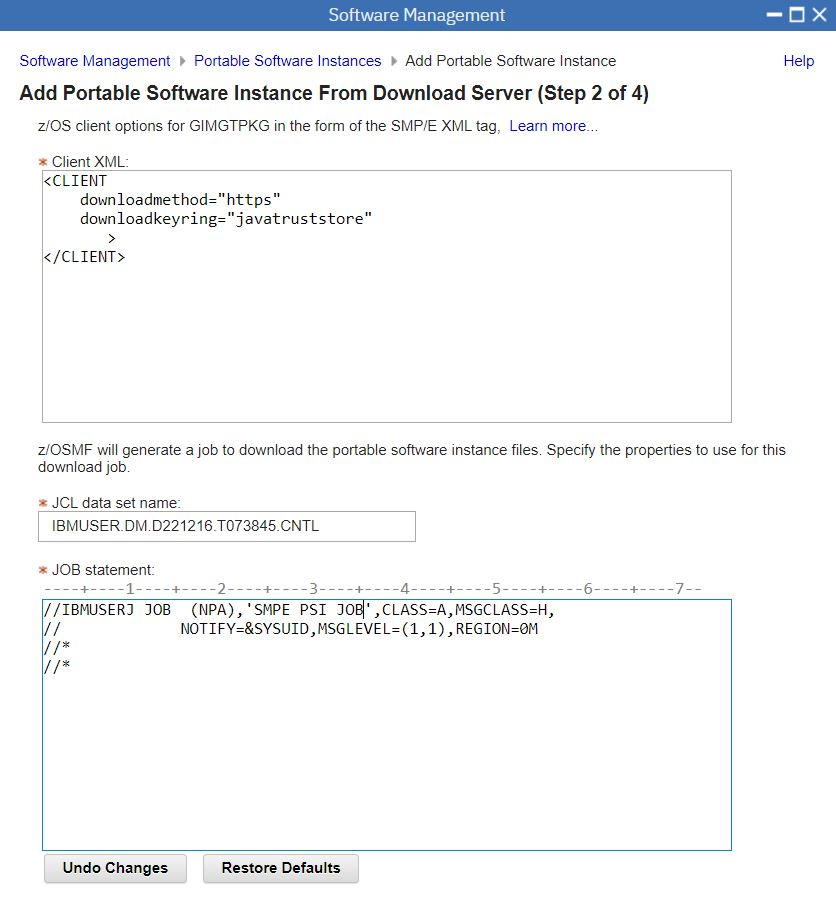
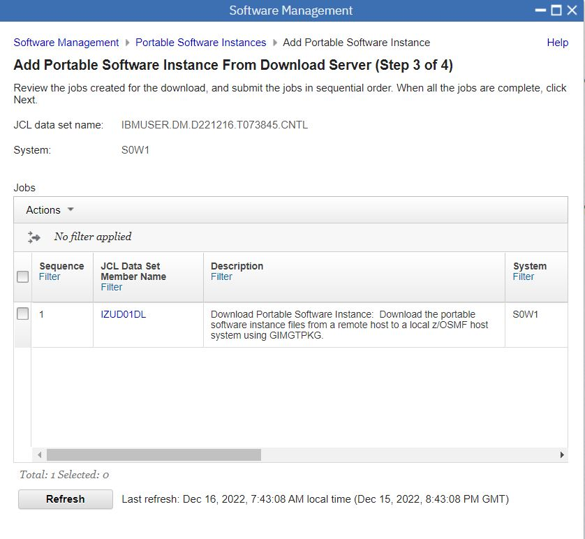
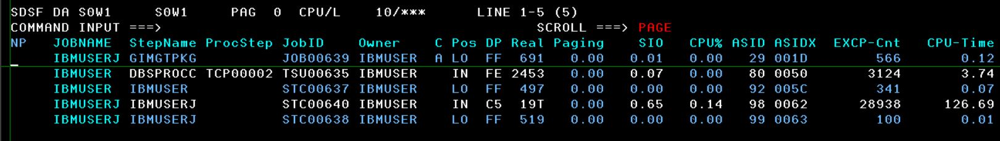

# Classic CDC for IMS

## SMPE Server XML

20221216

```
=== Order Size and File System Size Information ========================
                                                                        
The size of your order is 549 MB                                        
                                                                        
You need space in the file system used by z/OSMF Software Management    
Add Portable Software Instance for approximately twice the size of your 
order. To convert to 3390 cylinders, multiply the number of MB by 1.25  
and then multiply by 2.                                                 
                                                                        
For example, for a size of 5000 MB, then:                               
( (5,000 MB) * (1.25 CYL/MB) ) * 2 = 12,500 cylinders                   
                                                                        
== Server XML for Add Portable Software Instance From Download Server ==
You can copy the below statements into the z/OSMF Software Management   
Server XML box.                                                         
                                                                        
<SERVER                                                                 
  host="deliverycb-mul.dhe.ibm.com"                                     
  user="P355749c"                                                       
  pw="k9896491426p26b"                                                  
  >                                                                     
  <PACKAGE                                                              
      file="2022121500012/PROD/content/GIMPAF.XML"                      
      hash="341FB67364B0DB2C86A3C6E2CDA790936D7F0BB4"                   
      id="ST251941.content"                                             
   >                                                                    
  </PACKAGE>                                                            
</SERVER> 
```

Client XML
```
<CLIENT
    downloadmethod="https"
    downloadkeyring="javatruststore"
       >
</CLIENT>
```

Job Statement
```
//IBMUSERJ JOB  (NPA),'SMPE PSI JOB',CLASS=A,MSGCLASS=H,
//             NOTIFY=&SYSUID,MSGLEVEL=(1,1),REGION=0M    
```


## Download

Process
1. Launch z/OSMF at ```https://192.168.1.191:10443/zosmf/```
2. Open "Software Management"
3. Select "Portable Software Instances"
4. Actions - "Add - From Download Server"
5. Step 1 : Name = CDCI ; Paste Server XML ; System = S0W1 ; UNIX Directory = /u/ibmuser/smpework/CDCI
6. Step 2 : Paste in Client XML and Job Card
7. Step 3 : Action - Submit Job 
8. Step 4 : Complete the Download

PSI Download Screenshot 1 - Download Step 1 


PSI Download Screenshot 2 - Download Step 2



PSI Download Screenshot 3 - Download Step 3



PSI Download Screenshot 4 - Observe from Browser in z/OSMF


PSI Download Screenshot 5 - Observe in SDSF



PSI Download Screenshot 6 - Observe ZFS filling up in USS


PSI Download Screenshot 6 - Download Step 4


## Deployment Workflows

Deployment Process
1. Launch z/OSMF at ```https://192.168.1.191:10443/zosmf/```
2. Open "Software Management"
3. Open "Deployments"
4. Select "New" and "Portable Software Instance"
5. Specify Name of Deployment (CDCI)
6. Select "CDCI" or whicher PSI you want to deploye
7. Objective = New CSI on target System S0W1
8. Optional - Check for missing SYSMODS
9. Configure Deployment (Accept Source Model, HLQs, Storage Classes, ZFS Mount Points )
10. Specifically - mount point for supplied MQ - allow deafult because we will use MQ9 from ADCD
11. Define Job Settings (location of PDS dataset for Jobs)
12. Submit Deployment Jobs ( Unzip ; Rename ; Update CSI )
13. Perform Workflows (Your Order & PostDeploy )

The Your Order workflow is nothing. Just override complete.

The PostDeploy Workflow contains important steps. JFDI

PSI Deploy Screenshot 1 - New Deployment


PSI Deploy Screenshot 2 - Specify Properties New Portable Software Instance (Name = CDCI)


PSI Deploy Screenshot 3 - Choose New Portable Software Instance


PSI Deploy Screenshot 4 - Configure Deployment


PSI Deploy Screenshot 5 - Modify HLQ & Storageclass


PSI Deploy Screenshot 6 - Check HLQ & Storageclass


PSI Deploy Screenshot 7 - Submit Deployment Jobs


PSI Deploy Screenshot 8 - Perform Workflows (YourOrder & PostDeploy)


